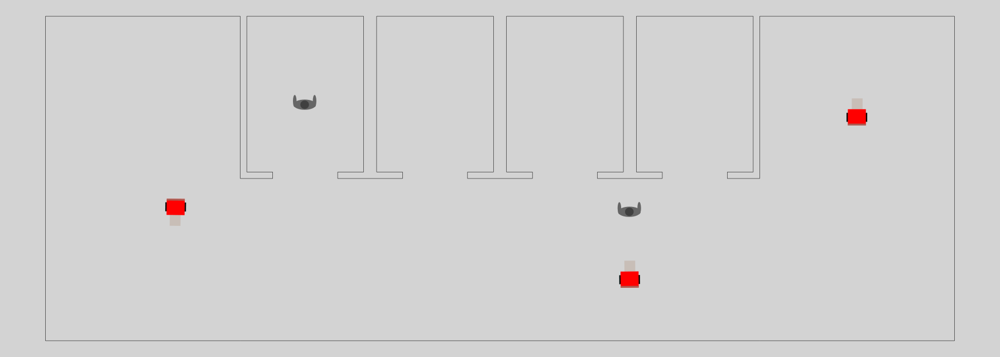

# navground_ri

This repository integrates the ri (robot_indoor) path planner in navground.

## Installation

1. Install `navground` following the [instructions](https://idsia-robotics.github.io/navground/latest/installation).

2. Install [ri_planning](https://github.com/jeguzzi/ri_planning).

3. Build this package using `colcon`

```console
$ colcon build --packages-select navground_ri
```

or install directly using Python

```console
$ python setup.py install
```

To check if it has been installed correctly, run

```console
$ navground_py plugins
...
navground_ri
------------
Tasks: WaypointsWithRIPlanner [Python]
Scenarios: IndoorGML [Python]
...
```

## Components

### `IndoorGML` scenario

```console
$ navground_py info --scenarios IndoorGML --properties --description 
Installed components
====================
Scenarios
---------
IndoorGML
    map_path:  (str)
      IndoorGML map path
    map_scale: 100.0 (float)
      IndoorGML map scale [units per meter]
```

Reads an IndoorGML maps and adds the corresponding walls to world.


### `WaypointsWithRIPlanner` task

```console
$ navground_py info --tasks WaypointsWithRIPlanner --properties --description
Installed components
====================
Tasks
-----
WaypointsWithRIPlanner
    curve: bezier_4 (str)
      Type of curve to compute: one of 'line', 'bezier_4', 'bezier_6'
    follow_horizon: 0.0 (float)
      The path following horizon
    layer_name:  (str)
      The IndoorGML layer to use for planning
    loop: False (bool)
      Whether to loop over waypoints
    map_path:  (str)
      The IndoorGML map path
    map_scale: 100.0 (float)
      The IndoorGML map scale [units per meter]
    opt_tol: 0.009999999776482582 (float)
      The optimization tolerance
    threaded: False (bool)
      Whether to compute plans in a separate thread
    tolerance: 1.0 (float)
      The waypoint tolerance
    waypoints: [array([0., 0.], dtype=float32)] ([vector])
      A list of waypoints (in meters)
```

A task that compute the optimal path towards the next waypoint based on a IndoorGML map. The planner either optimize length (``curve: line``) or a cost related to curvature that is a prozy for the user sitting on a wheelchair, see

  Jérôme Guzzi; Gianni A. Di Caro, ["From indoor GIS maps to path planning for autonomous wheelchairs"](https://ieeexplore.ieee.org/document/7759701/), IROS, 2016.


## Example

The `example` directory contains an example of a navground experiment where  wheelchairs and people uses `WaypointsWithPlanner` to navigate in an indoor map. The wheelchairs planner compute the smoothest path, while the pedestrains planner computes the shortest path.

```console
$ navground_py record_video examples/simple.yaml simple.mp4 --factor 5 --seed 1 --width 1280
```


## Acknowledgement and disclaimer

The work was supported in part by [REXASI-PRO](https://rexasi-pro.spindoxlabs.com) H-EU project, call HORIZON-CL4-2021-HUMAN-01-01, Grant agreement no. 101070028.


The work has been partially funded by the European Union. Views and opinions expressed are however those of the author(s) only and do not necessarily reflect those of the European Union or the European Commission. Neither the European Union nor the European Commission can be held responsible for them.
